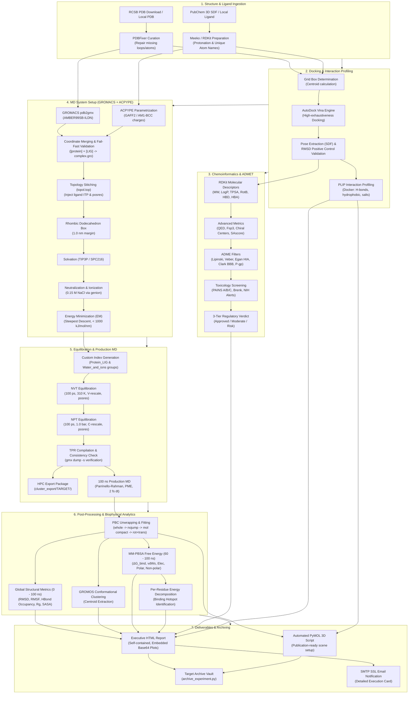

# Molecular Docking & Molecular Dynamics Pipeline (SBDD-MD)

[](https://www.python.org/downloads/)
[](https://www.gromacs.org/)
[](https://github.com/ccsb-scripps/AutoDock-Vina)
[](https://www.rdkit.org/)
[](https://openmm.org/)
[](https://github.com/astral-sh/uv)
[](https://github.com/astral-sh/ruff)
[](https://opensource.org/licenses/MIT)

An end-to-end, production-grade computational pipeline for **Structure-Based Drug Design (SBDD)**. This platform fully automates **molecular docking, virtual screening, in-silico ADMET/toxicity profiling, GROMACS molecular dynamics (MD) simulations, trajectory post-processing, and end-state binding free energy calculations (MM-PBSA)**.

Developed for structural bioinformaticians, medicinal chemists, and computational biophysicists, this pipeline addresses a foundational challenge in in-silico drug discovery: **managing complex multi-stage computational workflows, preventing intermediate file corruption, eliminating cross-target data contamination, and ensuring strict end-to-end scientific reproducibility.**

---

## 📑 Table of Contents

- [Molecular Docking \& Molecular Dynamics Pipeline (SBDD-MD)](#molecular-docking--molecular-dynamics-pipeline-sbdd-md)
  - [📑 Table of Contents](#-table-of-contents)
  - [🏛️ Architectural Pillars](#️-architectural-pillars)
  - [🔄 End-to-End Pipeline Workflow](#-end-to-end-pipeline-workflow)
  - [✨ Key Features](#-key-features)
    - [1. Structure Preparation \& Redocking Validation](#1-structure-preparation--redocking-validation)
    - [2. Virtual Screening \& Interaction Profiling (PLIP)](#2-virtual-screening--interaction-profiling-plip)
    - [3. Chemoinformatics \& ADMET/Toxicity Screening](#3-chemoinformatics--admettoxicity-screening)
    - [4. GROMACS Molecular Dynamics System Setup](#4-gromacs-molecular-dynamics-system-setup)
    - [5. Thermodynamic Equilibration (NVT / NPT)](#5-thermodynamic-equilibration-nvt--npt)
    - [6. 100 ns Production MD \& HPC Cluster Export](#6-100-ns-production-md--hpc-cluster-export)
    - [7. Trajectory Post-Processing \& Structural Analytics](#7-trajectory-post-processing--structural-analytics)
    - [8. MM-PBSA Free Energy \& Hotspot Decomposition](#8-mm-pbsa-free-energy--hotspot-decomposition)
    - [9. Publication-Grade HTML Reports \& 3D PyMOL Scenes](#9-publication-grade-html-reports--3d-pymol-scenes)
    - [10. Automated Notifications \& Experiment Archiving](#10-automated-notifications--experiment-archiving)
  - [📁 Software Architecture \& Directory Hierarchy](#-software-architecture--directory-hierarchy)
    - [Repository Layout](#repository-layout)
    - [Runtime Target Isolation Hierarchy](#runtime-target-isolation-hierarchy)
  - [💻 Installation \& Setup](#-installation--setup)
    - [Prerequisites](#prerequisites)
    - [1. Clone \& Install Environment with `uv`](#1-clone--install-environment-with-uv)
    - [2. AutoDock Vina Binary Setup](#2-autodock-vina-binary-setup)
    - [3. Docker Image for PLIP](#3-docker-image-for-plip)
    - [4. Optional: Configure Email Notifications](#4-optional-configure-email-notifications)
  - [🚀 CLI \& Interactive TUI Usage](#-cli--interactive-tui-usage)
    - [Interactive Mode (TUI)](#interactive-mode-tui)
    - [Command Reference](#command-reference)
      - [1. Positive Control \& Redocking Validation (`validate`)](#1-positive-control--redocking-validation-validate)
      - [2. Virtual Screening (`screen`)](#2-virtual-screening-screen)
      - [3. MD Preparation \& Minimization (`md-prep`)](#3-md-preparation--minimization-md-prep)
      - [4. NVT \& NPT Thermodynamic Equilibration (`md-equil`)](#4-nvt--npt-thermodynamic-equilibration-md-equil)
      - [5. Production Compilation \& Cluster Packaging (`md-compile`)](#5-production-compilation--cluster-packaging-md-compile)
      - [6. Export Cluster Package Only (`md-export`)](#6-export-cluster-package-only-md-export)
      - [7. Local Production MD Execution (`md-run`)](#7-local-production-md-execution-md-run)
      - [8. Trajectory Post-Processing \& MM-PBSA (`md-postprocess`)](#8-trajectory-post-processing--mm-pbsa-md-postprocess)
      - [9. Executive HTML Report \& PyMOL Scene (`report`)](#9-executive-html-report--pymol-scene-report)
  - [🌐 HPC \& Remote Execution Protocol (SSH / tmux)](#-hpc--remote-execution-protocol-ssh--tmux)
  - [🔬 Scientific Specifications \& Simulation Protocols](#-scientific-specifications--simulation-protocols)
  - [📦 Experiment Archival](#-experiment-archival)
  - [🤝 Contributing \& Community](#-contributing--community)
  - [📜 Citation \& References](#-citation--references)
  - [📄 License](#-license)

---

## 🏛️ Architectural Pillars

1. **Target Isolation Architecture (Zero Contamination):**
   Multi-target screening projects frequently fail due to shared-state race conditions and accidental coordinate overwrites. The pipeline enforces an immutable directory structure per biological target (`data/screening/<TARGET>/<LIGAND>/`, `data/md_files/<TARGET>/`, `cluster_export/<TARGET>/`) with deterministic target prefixing (`<TARGET>_complex.gro`, `<TARGET>_md.tpr`, etc.).
2. **Fail-Fast Molecular Integrity Validation:**
   Before allocating GPU/CPU hours to simulations, the pipeline executes rigorous pre-flight validation:
   - Validates protein N- and C-terminal integrity and presence of standard amino acids.
   - Enforces ligand coordinate retention and checks heavy-atom counts ($\ge 10$ heavy atoms).
   - Validates binary topology and run input consistency via `gmx dump -s` to trap corrupt `.tpr` files before cluster dispatch.
3. **Automated Stale-Artifact Purging:**
   GROMACS runs can read obsolete checkpoint files (`*.cpt`, `#*#`, old `.tpr`) when interrupted. The system inspects workspace directories and purges residual execution debris before launching downstream stages.
4. **Dual-Timescale Scientific Protocol:**
   - **Global Structural Sampling (0 – 100 ns):** Trajectory stability (backbone and ligand RMSD), residue flexibility (RMSF), hydrogen bond counts and occupancies, radius of gyration ($R_g$), SASA, and conformational clustering.
   - **Thermodynamic Equilibrium Window (60 – 100 ns):** The last 40% steady-state plateau is sampled for MM-PBSA free energy calculations and per-residue decomposition, eliminating non-equilibrium relaxation bias.
5. **HPC & Cloud Agnostic (SSH / tmux):**
   Generates completely self-contained, modular execution packages (`cluster_export/<TARGET>/`) equipped with auto-detecting GPU/CPU execution scripts (`run_local.sh`) and checkpoint resumption logic (`-cpi`). Run seamlessly across local workstations, Slurm clusters, cloud VMs, or remote SSH/tmux sessions.

---

## 🔄 End-to-End Pipeline Workflow



---

## ✨ Key Features

### 1. Structure Preparation & Redocking Validation
- **RCSB PDB Ingestion & Healing:** Automatically fetches targets from RCSB PDB, isolates crystallographic ligands, and employs `PDBFixer` to resolve missing heavy atoms, repair incomplete residues, and strip unwanted solvent/heteroatoms.
- **Ligand Coordinate Normalization:** Cleans ligands via `RDKit` and `Meeko`, ensures 3D geometry consistency, calculates Gasteiger partial charges (with robust zero-charge fallback), and normalizes atom names to unique sequences (`C1`, `C2`, `O1`...) to avoid GROMACS atom naming collisions.
- **Positive Control / Redocking:** Performs self-docking of the co-crystallized ligand and evaluates the root-mean-square deviation (RMSD) against the experimental crystal pose. Flags success if $\text{RMSD} \le 2.0\text{ \AA}$.

### 2. Virtual Screening & Interaction Profiling (PLIP)
- **High-Exhaustiveness Docking:** Runs AutoDock Vina with configurable box geometry (`cx`, `cy`, `cz`, `size`) and exhaustiveness settings. Cross-platform support includes bundled binaries for Linux and Windows.
- **Automated PLIP Containerization:** Dispatches the docked receptor-ligand complex directly into a containerized `pharmai/plip` engine, extracting atomic coordinates and distances for:
  - Hydrogen bonds (donor-acceptor and hydrogen-acceptor distances).
  - Hydrophobic interactions.
  - $\pi$-stacking and $\pi$-cation interactions.
  - Salt bridges and halogen bonds.

### 3. Chemoinformatics & ADMET/Toxicity Screening
- **Physicochemical Descriptors:** Exact molecular weight, Crippen $\text{Log}P$, topological polar surface area (TPSA), rotatable bonds, hydrogen bond donors/acceptors (HBD/HBA), and formal charge.
- **Advanced Medicinal Chemistry Metrics:**
  - **$F_{sp3}$:** Fraction of $sp^3$ hybridized carbons (stereochemical complexity and 3D character).
  - **QED:** Quantitative Estimate of Drug-likeness (Bickerton et al.).
  - **Chiral Center & Ring Profiling:** Identifies stereocenters and polycyclic frameworks.
  - **Synthetic Accessibility Score ($SA_{score}$):** Empirical synthetic complexity assessment (1.0 = easy, 10.0 = highly complex).
- **ADME Rule Compliance:**
  - Lipinski's Rule of Five (Pfizer).
  - Veber's Oral Bioavailability Rules (GSK).
  - Lead-likeness criteria (Teague & Oprea).
  - Human Intestinal Absorption (HIA) via the Egan Egg model.
  - Blood-Brain Barrier (BBB) permeability prediction via the Clark model.
  - P-glycoprotein (P-gp) substrate/efflux risk assessment.
- **Structural Alert & Toxicology Screening:** Comprehensive evaluation against medicinal chemistry liability databases via RDKit `FilterCatalog`:
  - PAINS (Pan-Assay Interference Compounds — Catalogues A, B, and C).
  - Brenk structural and reactive group alerts.
  - NIH toxicological and mutagenic alerts.
- **Multi-Tier Classification Verdict:** Synthesizes all criteria into a 3-tier verdict: `APPROVED (Bioavailable & Safe)`, `MODERATE (Accepted with Caveats)`, or `RISK (High Liability)`.

### 4. GROMACS Molecular Dynamics System Setup
- **Protein Topology:** Generated using GROMACS `pdb2gmx` parameterized with the `amber99sb-ildn` force field and `tip3p` water model.
- **Ligand Parameterization:** Automated topology generation with `ACPYPE` utilizing GAFF2 (General AMBER Force Field 2) and AM1-BCC charge derivation.
- **Topology Stitching:** Automatically incorporates `#include "ligand_md.acpype/ligand_md_GMX.itp"` and position restraint definitions (`posre_ligand_md.itp`) into the master `topol.top` file under `[ molecules ]`.
- **Optimal Box Geometry:** Constructs a rhombic dodecahedron simulation box (`-bt dodecahedron`) with a 1.0 nm minimum distance to boundary (`-d 1.0`), minimizing required water molecules and reducing computational cost by ~29% compared to cubic boxes.
- **Physiological Solvation & Neutralization:** Solvates with SPC216/TIP3P water and neutralizes system net charge with $0.15\text{ M}$ physiological NaCl using `genion` (replacing solvent molecules).
- **Steepest Descent Energy Minimization:** Executes energy minimization down to maximum force tolerance $F_{max} < 1000\text{ kJ/(mol}\cdot\text{nm)}$.

### 5. Thermodynamic Equilibration (NVT / NPT)
- **Programmatic Group Construction:** Generates custom GROMACS index groups (`Protein_LIG` and `Water_and_ions`) to prevent thermostat decoupling artifacts during two-group temperature coupling.
- **NVT Phase (Thermalization):** 100 ps simulation at 310 K ($37^\circ\text{C}$, human physiological temperature) using the stochastic velocity-rescaling thermostat (`V-rescale`, $\tau_t = 0.1\text{ ps}$) with heavy-atom position restraints.
- **NPT Phase (Density Equilibration):** 100 ps simulation at 1.0 bar using the modern `c-rescale` barostat ($\tau_p = 2.0\text{ ps}$) with center-of-mass coordinate scaling (`refcoord_scaling = com`).

### 6. 100 ns Production MD & HPC Cluster Export
- **Production Protocol:** 100 ns unconstrained production simulation (50,000,000 steps at a 2.0 fs timestep) with LINCS constraint algorithm, Particle Mesh Ewald (PME) long-range electrostatics, Parrinello-Rahman barostat, and compressed trajectory coordinates recorded every 10 ps (`nstxout-compressed = 5000`).
- **Cluster Export Package (`cluster_export/<TARGET>/`):**
  - Self-contained, portable directory containing `<TARGET>_md.tpr`, a deployment `README.md`, and an executable `run_local.sh`.
  - Zero Slurm/PBS dependencies required: designed for straightforward execution in persistent remote terminal multiplexers (`tmux` / `screen`).
  - Automatic GPU detection (`CUDA` / OpenCL) and optimal CPU thread distribution (`-ntmpi`, `-ntomp`).
  - Checkpoint resumption: detects `<TARGET>_md.cpt` and resumes simulations without manual command intervention (`-cpi -append`).

### 7. Trajectory Post-Processing & Structural Analytics
- **Periodic Boundary Condition (PBC) Correction:**
  1. `trjconv -pbc whole`: Reassembles broken covalent bonds across box boundaries.
  2. `trjconv -pbc nojump`: Eliminates unphysical coordinate jumps across simulation boundaries.
  3. `trjconv -center -pbc mol -ur compact`: Centers the complex and enforces compact molecular representation.
  4. `trjconv -fit rot+trans`: Fits rotational and translational movement against the energy-minimized reference structure, generating `<TARGET>_md_fit.xtc` and `<TARGET>_md_clean.gro`.
- **Structural Analysis Portfolio (0 – 100 ns):**
  - **Backbone & Ligand RMSD:** Quantifies conformational stability and ligand binding pocket drift over time.
  - **Per-Residue RMSF:** Maps C-$\alpha$ atomic flexibility to identify flexible loop regions and stabilized binding motifs.
  - **Hydrogen Bond Dynamics:** Profiles hydrogen bond count over time and calculates persistence/occupancy percentages for critical interactions.
  - **Radius of Gyration ($R_g$):** Measures overall structural compactness and folding stability.
  - **Solvent Accessible Surface Area (SASA):** Tracks total, hydrophobic, and hydrophilic solvent exposure.
  - **Conformational Clustering:** Uses the GROMOS algorithm to group trajectory frames into distinct conformational clusters and extracts representative centroid structures.
  - **Tabular Data Export:** Generates standardized CSV files for downstream statistical analysis.
  - **Publication Figures:** Generates 300 DPI high-resolution figures via Matplotlib and Seaborn.

### 8. MM-PBSA Free Energy & Hotspot Decomposition
- **End-State Free Energy Calculations:** Integrates `gmx_MMPBSA` with AmberTools to compute the net binding free energy:
  $$\Delta G_{\text{bind}} = \Delta E_{\text{MM}} + \Delta G_{\text{solv}} - T\Delta S$$
  where $\Delta E_{\text{MM}} = \Delta E_{\text{vdW}} + \Delta E_{\text{elec}}$ and $\Delta G_{\text{solv}} = \Delta G_{\text{polar}} (\text{PB}) + \Delta G_{\text{nonpolar}}$.
- **Thermodynamic Equilibrium Window:** Evaluates frames exclusively within the 60 – 100 ns range (the final 40% of the simulation), capturing the true equilibrium state and avoiding initial non-equilibrium equilibration artifacts.
- **Per-Residue Energy Decomposition:** Decomposes binding free energy by amino acid residue to identify key energetic contributors (hotspots) and destabilizing clashes, providing actionable insights for rational drug design and lead optimization.

### 9. Publication-Grade HTML Reports & 3D PyMOL Scenes
- **Interactive Executive HTML Report (`report.html`):**
  - Fully self-contained single-file document with zero external runtime dependencies.
  - All 300 DPI graphs (RMSD, RMSF, H-bonds, SASA, $R_g$, MM-PBSA decomposition) are embedded directly as base64-encoded strings.
  - Summarizes Vina scores, PLIP contact tables, 2D ADMET radars, drug-likeness filters, and thermodynamic summaries.
- **Automated PyMOL Scripting (`show_complex.pml`):**
  - Generates an automated visualization script targeting `<TARGET>_md_clean_nowat.pdb` and `<TARGET>_md_fit.xtc`.
  - Configures a clean publication layout (white background, cyan cartoon receptor, magenta stick ligand, active-site residue side chains highlighted, and yellow dashed lines indicating hydrogen bonds with distance labels).

### 10. Automated Notifications & Experiment Archiving
- **SMTP/SSL Background Email Alerts:** Long computational jobs (docking, equilibration, MD production, post-processing) automatically dispatch rich HTML summary cards containing run duration, target metadata, and key results via SMTP SSL (port 465).
- **Experiment Vault (`archive_experiment.py`):** Archives completed projects into organized packages under `archive/<EXPERIMENT_NAME>/` separating `docking/`, `topology/`, `trajectory/`, and `report/` for institutional archiving, publication supplementary material, or re-analysis.

---

## 📁 Software Architecture & Directory Hierarchy

### Repository Layout

```text
molecular_docking/
├── bin/                             # AutoDock Vina binaries (Linux/Windows)
│   ├── vina
│   └── vina.exe
├── src/
│   ├── main.py                      # Typer CLI application & Interactive TUI
│   ├── templates/
│   │   └── mdp/                     # Optimized GROMACS simulation parameter files
│   │       ├── minim.mdp            # Energy Minimization (Steepest Descent)
│   │       ├── nvt.mdp              # NVT Equilibration (310 K, V-rescale)
│   │       ├── npt.mdp              # NPT Equilibration (1.0 bar, C-rescale)
│   │       └── md.mdp               # 100 ns Production MD (Parrinello-Rahman)
│   └── docking/
│       ├── __init__.py
│       ├── box_utils.py             # Active-site centroid and grid calculations
│       ├── preparation.py           # PDB/PubChem download, PDBFixer, Meeko PDBQT prep
│       ├── vina_runner.py           # AutoDock Vina subprocess runner
│       ├── analysis.py              # Pose extraction, PLIP Docker runner & XML parser
│       ├── pharmacokinetics.py      # ADMET, Lipinski, Veber, QED, SAscore, PAINS, Brenk
│       ├── md_prep.py               # Amber/ACPYPE topology prep, box, solvation, ions, EM
│       ├── md_equil.py              # Custom index groups, NVT and NPT equilibration
│       ├── md_analysis.py           # PBC correction, RMSD/RMSF/Rg/SASA/MMPBSA/plotting
│       ├── visualization.py         # PyMOL (.pml) automated scene generation
│       ├── report.py                # Single-file HTML executive report generator
│       └── notifier.py              # SMTP/SSL email notification engine
├── archive_experiment.py            # Long-term experiment archiving utility
├── pyproject.toml                   # Project dependencies and packaging configuration
├── uv.lock                          # Deterministic dependency lockfile
└── .env                             # Local SMTP credentials (optional)
```

### Runtime Target Isolation Hierarchy

During workflow execution, data is segregated to avoid cross-contamination:

```text
data/
├── <PDB_ID>/
│   ├── raw/                         # Pristine crystallographic structures (.pdb)
│   ├── processed/                   # Prepared receptors and native ligands (.pdbqt)
│   └── results/                     # Redocking poses, PLIP reports, ADMET JSONs
├── screening/
│   └── <PDB_ID>/
│       └── <LIGAND_NAME>/
│           ├── <TARGET>_<LIGAND>_docked.pdbqt
│           ├── <TARGET>_<LIGAND>_docked_poses.sdf
│           ├── <TARGET>_<LIGAND>_interactions.json
│           └── complex_report.xml
└── md_files/
    └── <PDB_ID>/
        ├── <PDB_ID>_receptor_fixed.pdb
        ├── <PDB_ID>_ligand_md.pdb
        ├── <PDB_ID>_complex.gro
        ├── <PDB_ID>_topol.top
        ├── <PDB_ID>_em.tpr / <PDB_ID>_em.gro
        ├── <PDB_ID>_index.ndx
        ├── <PDB_ID>_nvt.tpr / <PDB_ID>_nvt.gro
        ├── <PDB_ID>_npt.tpr / <PDB_ID>_npt.gro
        ├── <PDB_ID>_md.tpr / <PDB_ID>_md.xtc
        ├── <PDB_ID>_md_fit.xtc / <PDB_ID>_md_clean.gro
        ├── <PDB_ID>_rmsd.png / <PDB_ID>_rmsf.png / <PDB_ID>_hbond.png
        ├── <PDB_ID>_FINAL_RESULTS_MMPBSA.dat
        ├── <PDB_ID>_mmpbsa_summary.json
        ├── report.html              # Executive HTML Report
        └── show_complex.pml         # Automated PyMOL 3D Script

cluster_export/
└── <PDB_ID>/
    ├── <PDB_ID>_md.tpr              # Binary input ready for production
    ├── run_local.sh                 # GPU/CPU aware launch script with auto-resumption
    └── README.md                    # Remote cluster execution instructions
```

---

## 💻 Installation & Setup

### Prerequisites

- **Operating System:** Linux (Ubuntu 20.04+, Debian 11+, Rocky Linux 9+), macOS, or Windows 10/11 via WSL2.
- **Python:** Python `>= 3.13` (managed automatically by `uv`).
- **External Binaries:**
  - **GROMACS** (`>= 2022`, with GPU support recommended).
  - **ACPYPE** (available via conda-forge / `bioinfo` environment).
  - **Docker Engine** (required for automated PLIP interaction profiling).
  - **OpenMM** & **PDBFixer** (managed via `pyproject.toml`).
  - **AmberTools / gmx_MMPBSA** (required for MM-PBSA calculations).

### 1. Clone & Install Environment with `uv`

We recommend [uv](https://github.com/astral-sh/uv) for fast, deterministic Python virtual environment management:

```bash
# Clone repository
git clone https://github.com/mellornm/molecular_docking.git
cd molecular_docking

# Synchronize dependencies using uv
uv sync
```

### 2. AutoDock Vina Binary Setup

The pipeline automatically checks for `bin/vina` (Linux) or `bin/vina.exe` (Windows). If absent, it downloads AutoDock Vina 1.2.5 from the Scripps Research GitHub releases on first invocation.

### 3. Docker Image for PLIP

Pull the official PLIP container image:

```bash
docker pull pharmai/plip
```

### 4. Optional: Configure Email Notifications

Create a `.env` file in the project root to enable automated email notifications:

```env
SMTP_SERVER=smtp.gmail.com
SMTP_PORT=465
SMTP_USE_SSL=true
SMTP_USER=your_email@gmail.com
SMTP_PASSWORD=your_app_specific_password
EMAIL_RECEIVER=target_email@example.com
EMAIL_NOTIFICATIONS_ENABLED=true
```

Test the notification pipeline:

```bash
uv run src/main.py test-email
```

---

## 🚀 CLI & Interactive TUI Usage

### Interactive Mode (TUI)

The simplest way to navigate the entire pipeline is the built-in terminal UI:

```bash
uv run src/main.py interactive
```

This presents a structured menu guiding you through every stage:
1. Positive Control / Validation (Redocking)
2. PubChem Ligand Download (by CID)
3. Ligand Preparation (SDF $\to$ PDBQT)
4. Virtual Screening
5. MD System Preparation & Minimization (GROMACS + ACPYPE)
6. Thermodynamic Equilibration (NVT / NPT)
7. Production TPR Compilation & Cluster Packaging
8. Production MD Simulation (100 ns)
9. Post-Processing, Graphics & MM-PBSA
10. Generate Executive HTML Report & PyMOL 3D Script
11. Test Alert Email Notifications
12. Exit

---

### Command Reference

Individual stages can be executed independently through the Typer CLI:

#### 1. Positive Control & Redocking Validation (`validate`)
Downloads the target PDB, separates the co-crystallized ligand, prepares PDBQT files, computes the grid box, runs AutoDock Vina, profiles interactions with PLIP, calculates ADMET metrics, and checks RMSD vs the crystallographic pose:

```bash
uv run src/main.py validate --pdb 4HG7 --ex 16
```

#### 2. Virtual Screening (`screen`)
Docks a prepared ligand against a receptor inside user-defined active-site coordinates:

```bash
uv run src/main.py screen \
  --receptor data/EXPERIMENT_NAME/processed/EXPERIMENT_NAME_receptor.pdbqt \
  --ligand data/Desoxicolato.pdbqt \
  --target EXPERIMENT_NAME \
  --cx 12.50 --cy 8.20 --cz -15.40 \
  --size 22.0 \
  --ex 16
```

#### 3. MD Preparation & Minimization (`md-prep`)
Cures the protein with PDBFixer, parametrizes the ligand with ACPYPE (GAFF2/AM1-BCC), merges coordinates, stitches topologies, defines a rhombic dodecahedron box, solvates with TIP3P, neutralizes with 0.15 M NaCl, and performs energy minimization:

```bash
uv run src/main.py md-prep \
  --receptor data/EXPERIMENT_NAME/processed/EXPERIMENT_NAME_receptor.pdb \
  --sdf data/screening/EXPERIMENT_NAME/Desoxicolato/EXPERIMENT_NAME_Desoxicolato_docked_poses.sdf \
  --target EXPERIMENT_NAME \
  --purge
```

#### 4. NVT & NPT Thermodynamic Equilibration (`md-equil`)
Constructs temperature-coupling groups (`Protein_LIG` and `Water_and_ions`), builds position restraints, and executes NVT and NPT equilibration:

```bash
uv run src/main.py md-equil \
  --dir data/md_files/EXPERIMENT_NAME \
  --target EXPERIMENT_NAME
```

#### 5. Production Compilation & Cluster Packaging (`md-compile`)
Compiles the production binary input `<TARGET>_md.tpr`, performs binary validation (`gmx dump -s`), and packages the job into `cluster_export/<TARGET>/`:

```bash
uv run src/main.py md-compile \
  --dir data/md_files/EXPERIMENT_NAME \
  --target EXPERIMENT_NAME
```

#### 6. Export Cluster Package Only (`md-export`)
Generates the self-contained cluster package from an existing directory without recompiling:

```bash
uv run src/main.py md-export \
  --dir data/md_files/EXPERIMENT_NAME \
  --target EXPERIMENT_NAME
```

#### 7. Local Production MD Execution (`md-run`)
Runs the 100 ns production simulation locally, automatically detecting available GPUs:

```bash
uv run src/main.py md-run \
  --dir data/md_files/EXPERIMENT_NAME \
  --target EXPERIMENT_NAME
```

#### 8. Trajectory Post-Processing & MM-PBSA (`md-postprocess`)
Removes PBC jumps, aligns trajectories (`rot+trans`), calculates RMSD, RMSF, H-bonds, $R_g$, SASA, runs GROMOS clustering, generates 300 DPI figures, and computes MM-PBSA free energy across 60–100 ns:

```bash
uv run src/main.py md-postprocess \
  --dir data/md_files/EXPERIMENT_NAME \
  --target EXPERIMENT_NAME
```
*(Add `--skip-mmpbsa` if you only require structural analyses without thermodynamic calculations).*

#### 9. Executive HTML Report & PyMOL Scene (`report`)
Generates the self-contained publication HTML report and the automated PyMOL 3D visualization script:

```bash
uv run src/main.py report \
  --dir data/md_files/EXPERIMENT_NAME \
  --receptor EXPERIMENT_NAME \
  --ligand Desoxicolato
```

---

## 🌐 HPC & Remote Execution Protocol (SSH / tmux)

Because 100 ns molecular dynamics simulations are computationally demanding, the pipeline provides a streamlined export and remote execution workflow:

```bash
# 1. Compile and package the simulation locally
uv run src/main.py md-compile --dir data/md_files/EXPERIMENT_NAME --target EXPERIMENT_NAME

# 2. Transfer the self-contained bundle to your HPC cluster or cloud VM
rsync -avP cluster_export/EXPERIMENT_NAME/ user@hpc-cluster.univ.edu:/scratch/users/user/simulations/EXPERIMENT_NAME/

# 3. Connect via SSH and launch a persistent tmux session
ssh user@hpc-cluster.univ.edu
tmux new -s md_EXPERIMENT_NAME
cd /scratch/users/user/simulations/EXPERIMENT_NAME

# 4. Launch the simulation (auto-detects GPU and handles checkpoint recovery)
chmod +x run_local.sh
./run_local.sh

# 5. Detach safely from tmux: press Ctrl+B, then D
#    Monitor progress at any time:
tail -f EXPERIMENT_NAME_md.log

# 6. Once completed, sync results back to your local workstation:
rsync -avP user@hpc-cluster.univ.edu:/scratch/users/user/simulations/EXPERIMENT_NAME/ data/md_files/EXPERIMENT_NAME/

# 7. Run post-processing, MM-PBSA, and reporting locally:
uv run src/main.py md-postprocess --dir data/md_files/EXPERIMENT_NAME --target EXPERIMENT_NAME
uv run src/main.py report --dir data/md_files/EXPERIMENT_NAME --receptor EXPERIMENT_NAME --ligand Desoxicolato
```

---

## 🔬 Scientific Specifications & Simulation Protocols

| Parameter | Specification | Scientific Rationale |
| :--- | :--- | :--- |
| **Protein Force Field** | AMBER99SB-ILDN | Accurate peptide backbone representation with improved side-chain torsion parameters |
| **Ligand Parameterization** | GAFF2 / AM1-BCC charges | Broad small-molecule chemical coverage with semi-empirical electrostatic potential fitting |
| **Water Model** | TIP3P (rigid 3-site) | Fast, well-balanced solvation dynamics matched to AMBER parameter sets |
| **Simulation Box** | Rhombic Dodecahedron (`d = 1.0 nm`) | ~29% fewer solvent molecules than cubic boxes with identical periodic separation |
| **Ion Concentration** | $0.15\text{ M NaCl}$ (neutralized) | Matches human physiological ionic strength |
| **Thermostat** | V-rescale (Bussi-Donadio-Parrinello) | Canonical ensemble sampling with smooth, stable kinetic energy fluctuations ($\tau_t = 0.1\text{ ps}$) |
| **Barostat (Equilibration)** | C-rescale | Robust pressure control during initial thermal equilibration with coordinate scaling |
| **Barostat (Production)** | Parrinello-Rahman | True NPT isothermal-isobaric ensemble fluctuation sampling ($\tau_p = 2.0\text{ ps}$) |
| **Electrostatics** | PME (Particle Mesh Ewald) | Accurate representation of long-range Coulomb interactions ($1.0\text{ nm}$ real-space cutoff) |
| **van der Waals Cutoff** | $1.0\text{ nm}$ with force switching | Standard AMBER cutoffs with smoothed potential decay |
| **Hydrogen Constraints** | LINCS algorithm | Eliminates fastest bond-vibrational degrees of freedom, enabling a stable 2.0 fs integration step |
| **Production Timescale** | 100 ns ($50\times 10^6$ steps) | Sufficient sampling for pocket adaptation, induced-fit adjustments, and binding stability |
| **MM-PBSA Window** | 60 – 100 ns (Final 40%) | Samples the equilibrium state while excluding early non-equilibrium relaxation |

---

## 📦 Experiment Archival

When publishing or concluding a screening campaign, use `archive_experiment.py` to compile an immutable, organized archive:

```bash
uv run archive_experiment.py
```

The tool interactive prompts for the target directory and outputs an organized vault under `archive/<EXPERIMENT_NAME>/`:

```text
archive/EXPERIMENT_NAME/
├── docking/                         # Receptors, ligands, Vina logs, and docked poses
├── topology/                        # AMBER/GROMACS topologies, ITPs, and index files
├── trajectory/                      # Fitted XTC trajectories, clean GRO coordinates, TPRs
└── report/                          # Final HTML reports, publication plots, and PyMOL scripts
```

This archive can be preserved long-term, deposited in Zenodo/Dryad, or shared with collaborators.

---

## 🤝 Contributing & Community

Contributions, bug reports, and feature proposals are welcome!

1. Fork the repository on GitHub.
2. Create a feature branch: `git checkout -b feature/new-analysis-module`.
3. Format and lint your code: `uv run ruff check --fix . && uv run ruff format .`.
4. Commit your changes: `git commit -m "feat: add water-bridge occupancy tracker"`.
5. Push to your fork: `git push origin feature/new-analysis-module`.
6. Submit a Pull Request.

---

## 📜 Citation & References

If you use this pipeline in academic work or pharmaceutical research, please cite the underlying tools:

- **AutoDock Vina:** Eberhardt, J. et al. (2021). *AutoDock Vina 1.2.0: New Docking Methods, Expanded Force Field, and Python Bindings.* J. Chem. Inf. Model., 61(8), 3891–3898.
- **GROMACS:** Abraham, M. J. et al. (2015). *GROMACS: High performance molecular simulations through multi-level parallelism from laptops to supercomputers.* SoftwareX, 1–2, 19–25.
- **ACPYPE:** Sousa da Silva, A. W. & Vranken, W. F. (2012). *ACPYPE - AnteChamber PYthon Parser InterfacE.* BMC Research Notes, 5, 367.
- **PLIP:** Salentin, S. et al. (2015). *PLIP: fully automated protein-ligand interaction profiler.* Nucleic Acids Res., 43(W1), W443–W447.
- **gmx_MMPBSA:** Valdés-Tresanco, M. S. et al. (2021). *gmx_MMPBSA: A New Tool to Perform End-State Free Energy Calculations with GROMACS.* J. Chem. Theory Comput., 17(10), 6281–6291.
- **RDKit:** RDKit: Open-source cheminformatics. [https://www.rdkit.org](https://www.rdkit.org)
- **OpenMM:** Eastman, P. et al. (2017). *OpenMM 7: Rapid development of high performance algorithms for molecular dynamics.* PLOS Comput. Biol., 13(7), e1005659.

---

## 📄 License

This project is licensed under the [MIT License](https://opensource.org/licenses/MIT). You are free to use, modify, distribute, and integrate this software in commercial and academic applications.
